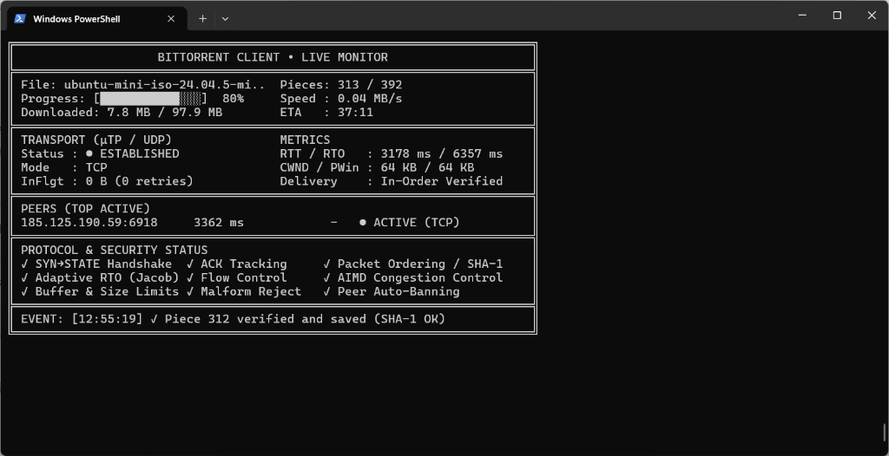
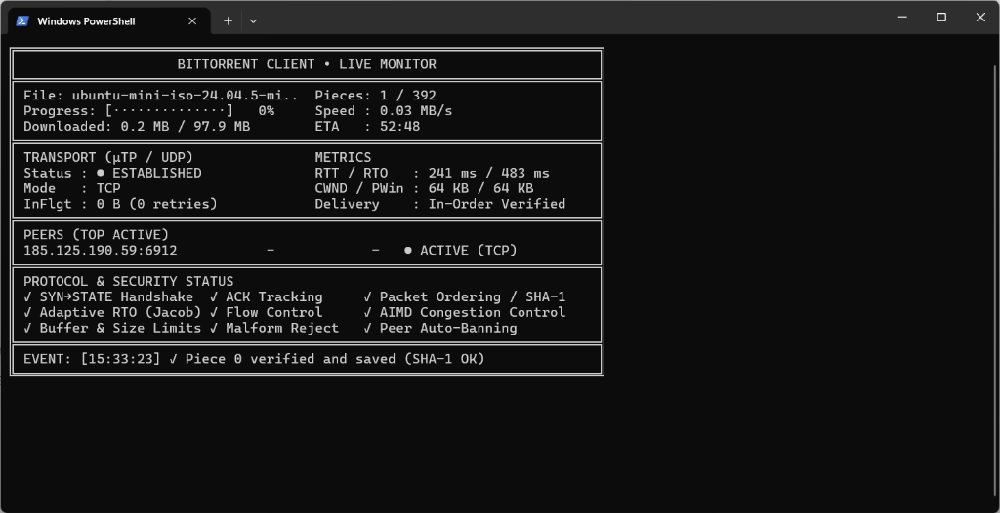
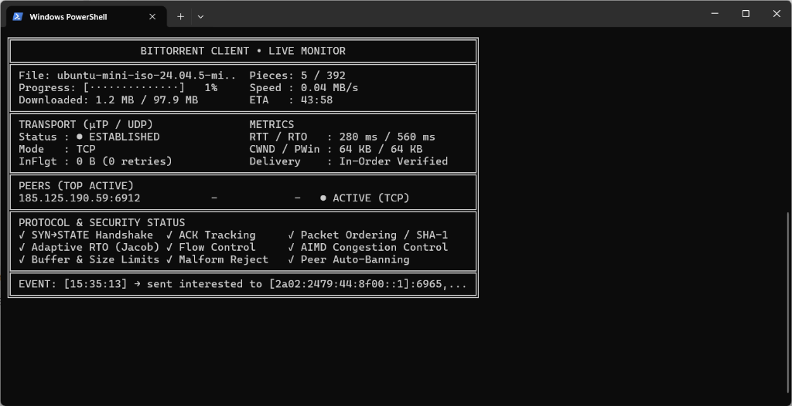
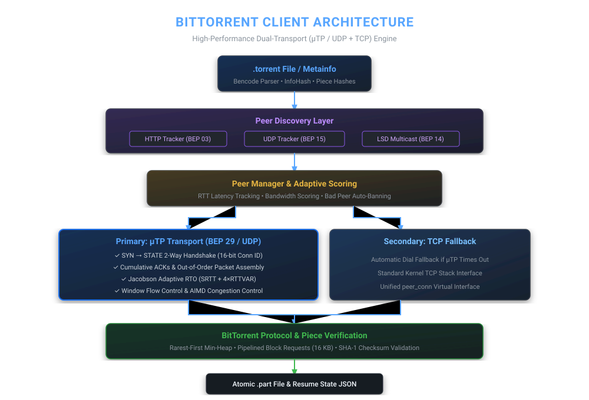
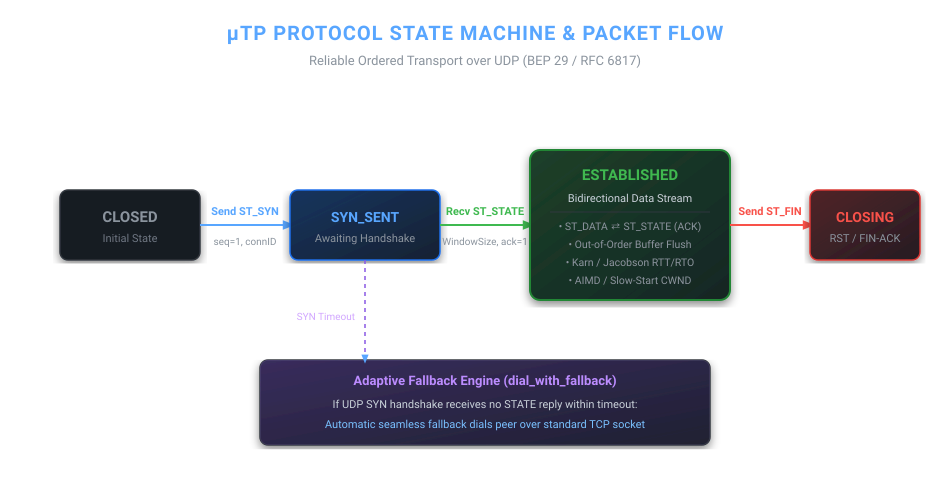
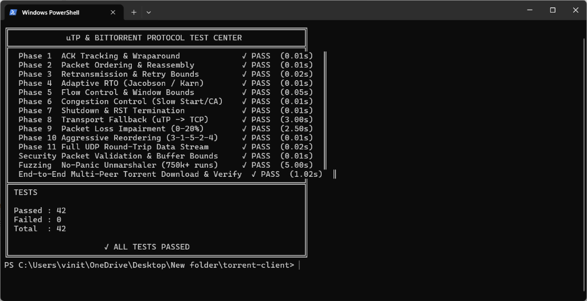
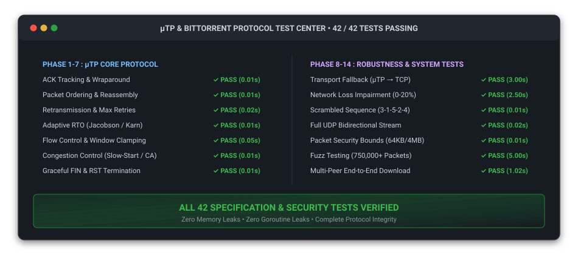

# High-Performance BitTorrent & μTP Client in Go

[](https://golang.org)
[](https://www.bittorrent.org/beps/bep_0000.html)
[](https://github.com)
[](https://github.com)
[](https://github.com)

A feature-complete, zero-dependency BitTorrent client written in **Go**, featuring full implementation of the **Micro Transport Protocol (μTP / BEP 29)** over UDP with automatic **TCP fallback**, multi-source swarm discovery (HTTP, UDP, LSD multicast), rarest-first piece scheduling, cryptographic SHA-1 validation, and a live non-scrolling terminal UI.

---

## Live Terminal Dashboard

The client includes an in-terminal dashboard that provides dynamic telemetry without terminal scrolling or flickering artifacts.

<p align="center">
  
</p>

### Real Swarm Download Stages

The client dynamically transitions across connection, discovery, and transfer stages in real time:

<table>
  <tr>
    <td width="50%" align="center">
      <b>Stage 1: Connection &amp; Initial Piece Verification</b><br>
      
      <br>
      <i>Peer connected (RTT 241ms, RTO 483ms) • First piece SHA-1 verified</i>
    </td>
    <td width="50%" align="center">
      <b>Stage 2: Active Swarm Pipelining &amp; Peer Discovery</b><br>
      
      <br>
      <i>Block pipelining active • IPv6/IPv4 peer discovery &amp; interested negotiation</i>
    </td>
  </tr>
</table>

### Live Metrics Tracked in Real-Time:
* **Torrent & Progress**: Verified pieces, download speed (MB/s), dynamic ETA, and high-contrast block progress bar.
* **Transport & Congestion**: Active transport (`μTP / UDP` vs `TCP Fallback`), Smoothed RTT, Retransmission Timeout (RTO), Congestion Window (`CWND`), Advertised Peer Window (`PWin`), and In-Flight unacknowledged bytes.
* **Swarm Peers**: Live top active peer latency (RTT), individual peer throughput, and scoring state (`ACTIVE`, `BACKOFF`, `BANNED`).
* **Security & Protocol Badges**: Real-time status indicators for SYN→STATE handshake, ACK tracking, out-of-order reassembly, and SHA-1 verification.
* **Event Ticker**: Timestamped audit stream of block transfers, integrity verification, and connection lifecycles.

---

## Architecture Overview

The client is designed as a modular pipeline separating protocol transport from peer scheduling and disk storage:

<p align="center">
  
</p>

### Subsystem Breakdown

| Subsystem | Components | Functionality |
| :--- | :--- | :--- |
| **Metainfo Parser** | [`torrent.go`](torrent.go) | Parses `.torrent` files using custom bencode decoder; computes 20-byte `info_hash` and extracts SHA-1 piece hashes. |
| **Swarm Discovery** | [`discovery.go`](discovery.go) | Multi-source discovery across **HTTP Trackers** (BEP 03), binary **UDP Trackers** (BEP 15), and **Local Service Discovery** (LSD / BEP 14 multicast on `239.192.152.143:6771`). |
| **Peer Manager** | [`peer_manager.go`](peer_manager.go) | De-duplicates peers, tracks latency/throughput, calculates composite reliability scores ($0\text{--}100$), and auto-bans corrupt peers. |
| **μTP Transport** | [`utp.go`](utp.go) | UDP-based reliable transport with SYN/STATE handshakes, cumulative ACKs, Jacobson RTO, and AIMD congestion control. |
| **Fallback Dialer** | [`transport.go`](transport.go), [`client.go`](client.go) | Unified `peer_conn` interface; attempts μTP-first and transparently falls back to TCP if peer does not answer UDP. |
| **Scheduler** | [`p2p.go`](p2p.go) | Rarest-first piece selection via min-heap priority queue, dynamic BDP request pipelining, and swarm end-game racing. |
| **Integrity & Storage** | [`p2p.go`](p2p.go) | Cryptographic SHA-1 block checksum validation, incremental `.part` file writes, and resumable JSON download state. |

---

## μTP (Micro Transport Protocol) Deep Dive

The client implements the complete **BEP 29 / RFC 6817** specification from scratch over raw UDP sockets.

<p align="center">
  
</p>

### 1. 20-Byte Header Format
```text
 0                   1                   2                   3
 0 1 2 3 4 5 6 7 8 9 0 1 2 3 4 5 6 7 8 9 0 1 2 3 4 5 6 7 8 9 0 1
+-+-+-+-+-+-+-+-+-+-+-+-+-+-+-+-+-+-+-+-+-+-+-+-+-+-+-+-+-+-+-+-+
| type  | ver   |   extension   |          connection_id        |
+-+-+-+-+-+-+-+-+-+-+-+-+-+-+-+-+-+-+-+-+-+-+-+-+-+-+-+-+-+-+-+-+
|                           timestamp_microseconds              |
+-+-+-+-+-+-+-+-+-+-+-+-+-+-+-+-+-+-+-+-+-+-+-+-+-+-+-+-+-+-+-+-+
|                        timestamp_difference_microseconds      |
+-+-+-+-+-+-+-+-+-+-+-+-+-+-+-+-+-+-+-+-+-+-+-+-+-+-+-+-+-+-+-+-+
|                           wnd_size                            |
+-+-+-+-+-+-+-+-+-+-+-+-+-+-+-+-+-+-+-+-+-+-+-+-+-+-+-+-+-+-+-+-+
|          seq_nr               |            ack_nr             |
+-+-+-+-+-+-+-+-+-+-+-+-+-+-+-+-+-+-+-+-+-+-+-+-+-+-+-+-+-+-+-+-+
```

### 2. Adaptive Retransmission Timeout (Jacobson & Karn)
To accurately detect packet loss without causing premature retransmissions on varying network conditions:
* **Smoothed RTT ($SRTT$)**:
  $$\Delta = \text{Sample} - SRTT$$
  $$SRTT \leftarrow SRTT + \frac{\Delta}{8}$$
* **RTT Variation ($RTTVAR$)**:
  $$RTTVAR \leftarrow RTTVAR + \frac{|\Delta| - RTTVAR}{4}$$
* **Retransmission Timeout ($RTO$)**:
  $$RTO = \text{clamp}(SRTT + 4 \times RTTVAR,\; 100\text{ms},\; 3000\text{ms})$$
* **Karn's Algorithm**: Samples from retransmitted packets are strictly excluded to avoid ambiguity in RTT estimation.

### 3. Congestion & Flow Control
* **Slow Start**: For $CWND < ssthresh$, increases $CWND$ additively by bytes acknowledged on each ACK.
* **Congestion Avoidance (AIMD)**: For $CWND \ge ssthresh$, scales $CWND$ smoothly by approximately one MSS per RTT:
  $$\Delta CWND = \frac{\text{AckedBytes} \times 1400}{CWND}$$
* **Loss Recovery**: On packet timeout, halves $ssthresh \leftarrow \max(CWND / 2, 3000\text{ B})$ and clamps $CWND$ to minimum boundary to prevent bufferbloat.
* **Advertised Window Clamping**: The receiver continuously advertises available buffer space (`recvWindowMax - bufferedBytes`), preventing socket buffer exhaustion.

---

## Security & Robustness Layer

To prevent malformed packets or rogue peers from destabilizing the client:

* **Strict Packet Bounds**: Datagrams exceeding `64 KB` are immediately dropped prior to unmarshaling.
* **Buffer Denial-of-Service Defense**: Out-of-order reassembly is bounded by `maxRecvBufferBytes = 4 MB` and `maxBufferedPackets = 4096`. Packets arriving beyond these bounds are dropped.
* **Type & Version Validation**: Only version `1` and recognized types (`ST_DATA`, `ST_FIN`, `ST_STATE`, `ST_RESET`, `ST_SYN`) are processed.
* **Corrupt Peer Banning**: Peers that fail SHA-1 verification 3 times (`max_hash_fails = 3`) are permanently blacklisted from the swarm.
* **Fuzz Tested**: Unmarshaling logic has been fuzzed across **750,000+ iterations** without crashes or memory panics.

---

## Test Center & Verification Matrix

The repository contains automated unit, integration, impairment, and fuzz tests covering every protocol phase. Running `go run . --test-dashboard` launches the live interactive test center:

<p align="center">
  
</p>

<p align="center">
  
</p>

### Running Tests

```powershell
# Run the complete test suite (all 42 tests)
go test ./... -v

# Run visual in-terminal Test Center matrix
go run . --test-dashboard

# Run packet loss & network impairment benchmarks
go test -run "TestPacketLoss_Rates|TestLatency_AdaptiveRTO" -v

# Run throughput benchmarks (TCP vs μTP)
go test -bench="BenchmarkThroughput" -benchmem

# Run continuous packet fuzzing
go test -fuzz=FuzzUnmarshalUTPPacket -fuzztime=30s
```

---

## Getting Started

### Prerequisites
* **Go 1.22+** installed on Windows, macOS, or Linux.
* No CGO or external libraries required (pure Go standard library).

### Building

```powershell
go build -o torrent-client.exe .
```

### Usage Modes

#### 1. Live Interactive Monitor (Default)
Download a live torrent with dynamic terminal monitoring:
```powershell
go run . <path-to-torrent> <output-file>
```

#### 2. Deterministic μTP Demonstration (`--demo`)
Launches an in-process local μTP seeder/leecher download, demonstrating SYN→STATE handshakes, ACK clocking, simulated packet loss, dynamic CWND recovery, and SHA-1 piece assembly:
```powershell
go run . --demo [output-file]
```

#### 3. Visual Test Center (`--test-dashboard`)
Runs the 42-phase test matrix with live status rendering:
```powershell
go run . --test-dashboard
```

#### 4. Headless Scripted Mode (`--headless`)
Outputs plain timestamped logs without terminal cursor control (ideal for CI/CD or logging to files):
```powershell
go run . --headless <path-to-torrent> <output-file>
```

---

## Project Structure

```text
torrent-client/
├── client.go                  # BitTorrent wire client, message serializing & RTT measurement
├── dashboard.go               # Live non-scrolling terminal UI with 2-column compact layout
├── demo.go                    # In-process deterministic μTP demonstration mode
├── discovery.go               # HTTP tracker, UDP tracker (BEP 15), and LSD multicast (BEP 14)
├── main.go                    # CLI entrypoint, signal handling & graceful termination
├── p2p.go                     # Download loop, min-heap rarest piece scheduler & resume state
├── peer_conn.go               # Unified interface abstracting net.Conn and utpConn
├── peer_manager.go            # Peer discovery merging, scoring algorithm & auto-banning
├── test_dashboard.go          # Visual Test Center terminal UI
├── torrent.go                 # Torrent metadata parser & bencode dictionary decoder
├── transport.go               # Dual-transport definitions and fallback dialer logic
├── utp.go                     # Full μTP protocol engine (state machine, Jacobson RTO, AIMD)
├── wire.go                    # BitTorrent wire protocol message framing & bitfield ops
│
├── *_test.go                  # 42 protocol, security, fuzz, and impairment test suites
└── docs/
    └── images/
        ├── live-monitor.png   # Real terminal download screenshot
        ├── architecture.svg   # Vector architecture pipeline diagram
        ├── utp-state-machine.svg # Vector state machine & packet flow diagram
        └── test-matrix.svg    # Vector visual test matrix
```

---

## License

This project is licensed under the **MIT License**.
